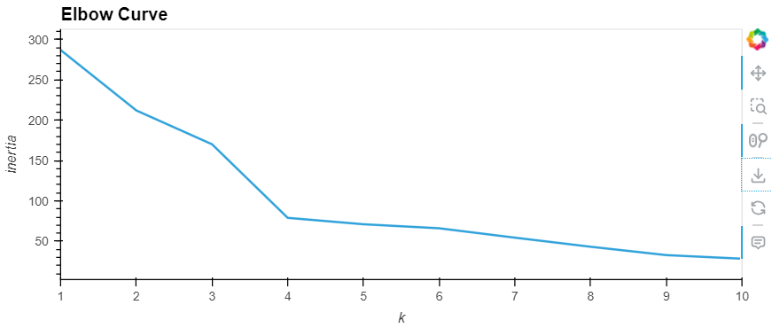
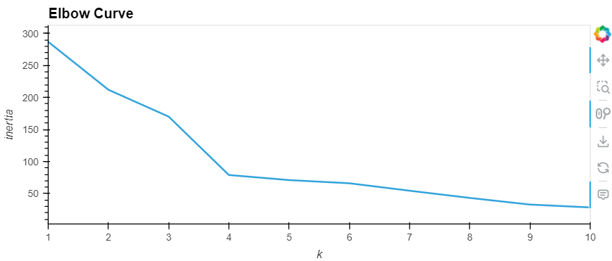
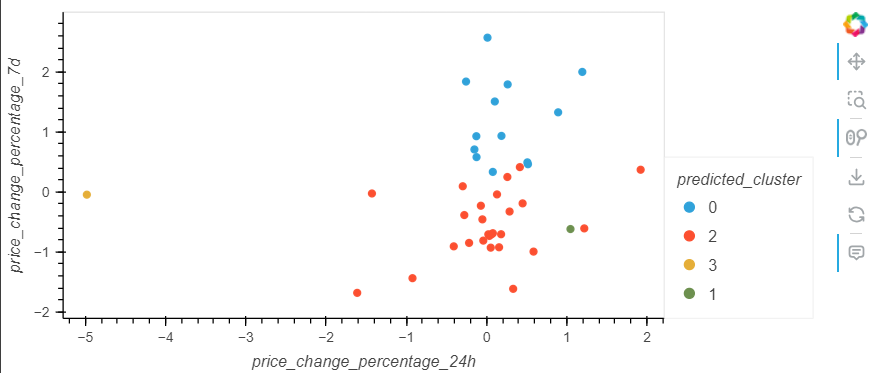
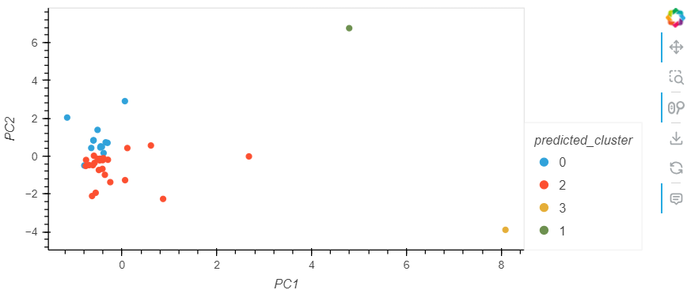

# Cryptocurrency Clustering Analysis using K-Means

This project explores the impact of using fewer features to cluster cryptocurrency data using the K-Means algorithm. The clustering was performed using both the original feature set and a reduced feature set (via PCA or manual selection), followed by visual analysis and comparison of the results.

---

## Objective

To evaluate how reducing the number of features affects the performance and visual clarity of clusters generated through K-Means clustering.

---

## Dataset

The dataset contains various time-based percentage price changes for multiple cryptocurrencies, including:

- 24h
- 7d
- 14d
- 30d
- 60d
- 200d
- 1y

---

## 1. Elbow Curve Comparison

**Elbow Curve 1 (Original Data):**
- Built using all 7 original time-based features.
- Shows a gradual decrease in inertia without a sharp elbow.
- Higher overall inertia values indicate **looser clusters** and possibly noisy data due to high dimensionality.

**Elbow Curve 2 (Reduced Features via PCA or Selection):**
- Demonstrates a **clear elbow point** and lower inertia values.
- Suggests better-defined clusters and **tighter groupings** of data points.
- Indicates improved clustering efficiency by removing redundant or less informative features.

---

## 2. Cluster Scatter Plot Comparison

**Cluster Graph 1 (Original Data):**
- Clusters appear **overlapping**, with no distinct boundaries.
- Difficult to interpret due to clutter caused by high-dimensional input.
- Indicates that clustering with all features may **not effectively reveal meaningful groupings**.

**Cluster Graph 2 (Reduced Features):**
- Shows **clear separation between clusters**.
- Easily identifiable and visually distinct groupings (e.g., 3–4 clusters).
- Indicates that reducing the number of features **helps highlight key patterns** and removes noise.

---

## Conclusion

Using fewer features (via dimensionality reduction or careful selection) for K-Means clustering of cryptocurrency data results in:

- More **compact and separable clusters**.
- Improved **visual clarity** and **interpretability**.
- Reduced **noise and redundancy**, allowing for better algorithm performance.

 **Fewer, more informative features = more meaningful clustering results.**

---

## 📂 Files

- `crypto_market_data.csv` – Raw dataset of cryptocurrency price changes.
- `Crypto_Clustering.ipynb` – Jupyter Notebook for preprocessing, clustering, and visualization.
- `README.md` – Summary and visual analysis of clustering results.

---

## Tools Used

- Python
- scikit-learn
- pandas
- hvPlot
- PCA (Principal Component Analysis)
- K-Means Clustering

---

## 📬 Contact

For any questions or insights, feel free to reach out!

